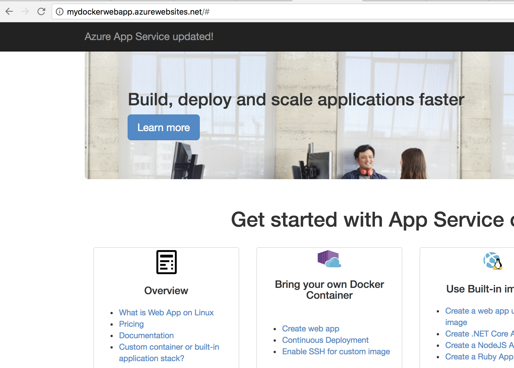
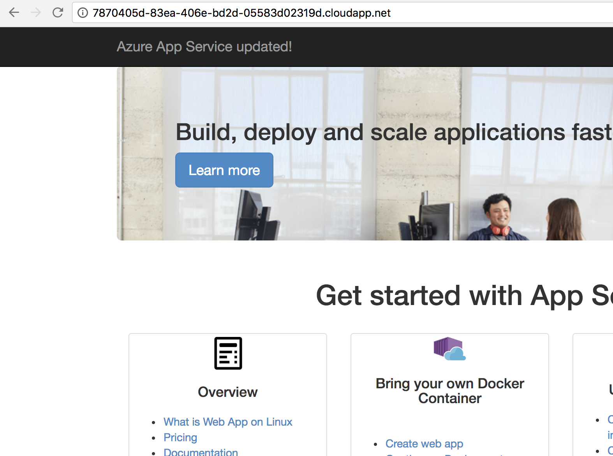
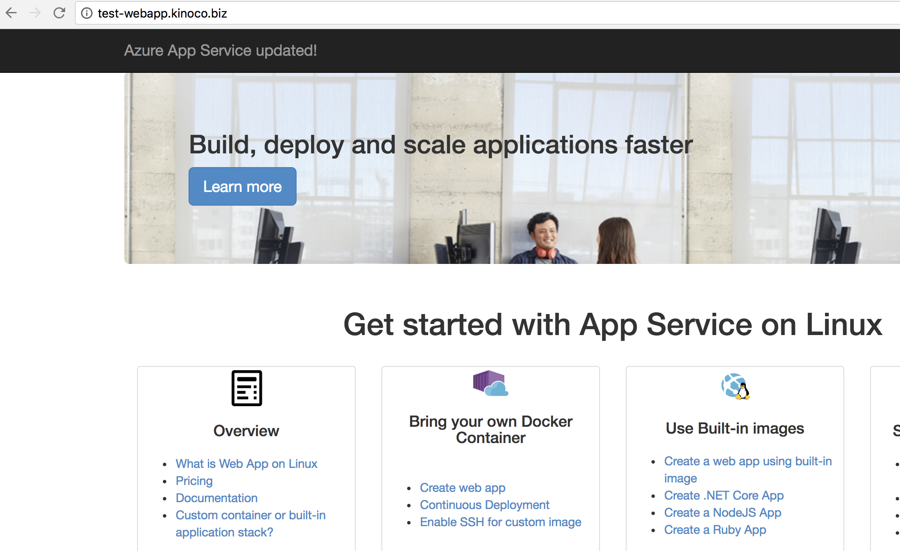
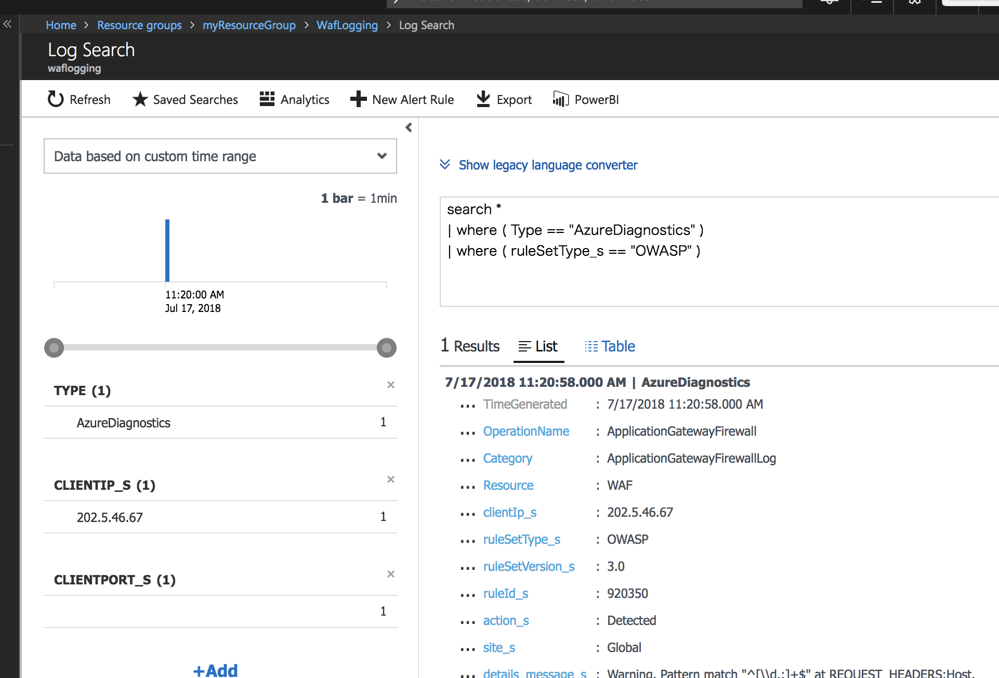
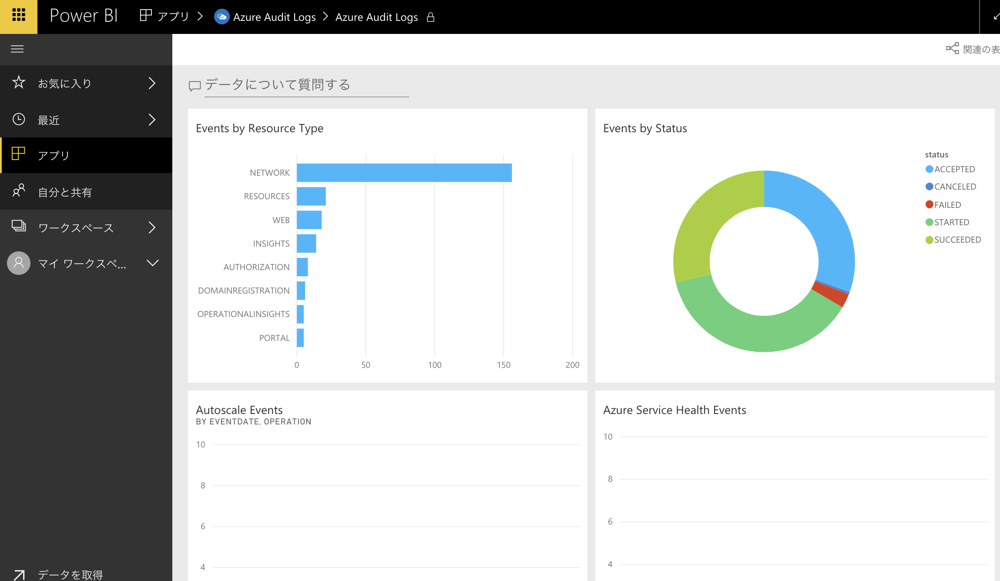

## AppgatewayWebApps

Docker Azure WebApps setup behind Application Gateway (WAF).

Application Gateway is the L7 Load Balancer in Azure, so that WebApps also can be backend.
However there are limitation that required using PowerShell to configure AppService as a backend.

## Limitation description

WebApps behind WAS only enabled by PowerShell Script because these 2 key parameter is only enabled by AzureRM PowerShell.
* key point1 : Add-AzureRmApplicationGatewayProbeConfig -PickHostNameFromBackendHttpSettings
* key point2 : Set-AzureRmApplicationGatewayBackendHttpSettings -PickHostNameFromBackendAddress

## Prerequisites

Use Shell and PowerShell Core.

```powershell
Install-Module AzureRM.Netcore -Scope CurrentUser
```

# Confirm access

* App Service Direct : NO WAF
> http://YOUR_APP_NAME.azurewebsites.net/#



* WAF Direct
> http://YOUR_WAF_NAME.cloudapp.net/



* WAF with CustomDomain
> http://YOUR_CUSTOM_DOMAIN/



## Monitoring

Use Log Analytics for Realtime monitor.

> https://blogs.technet.microsoft.com/robdavies/2017/12/29/monitoring-application-gateway-with-azure-log-analytics/



You can search ApplicationGatewayFirewallLog with following query.

```
search *
| where ( Type == "AzureDiagnostics" )
| where ( ruleSetType_s == "OWASP" )
```

You can use PowerBI for accesslogging, with importing "Azure Audit Logs" report.
But there are no ApplicationGatewayFirewallLog.

> https://docs.microsoft.com/en-us/power-bi/service-connect-to-azure-audit-logs



## Refer

> https://blogs.msdn.microsoft.com/waws/2017/11/21/setting-up-application-gateway-with-an-app-service-that-uses-azure-active-directory-authentication/

> https://docs.microsoft.com/en-us/azure/application-gateway/application-gateway-web-app-powershell#configure-a-web-app-behind-an-existing-application-gateway

